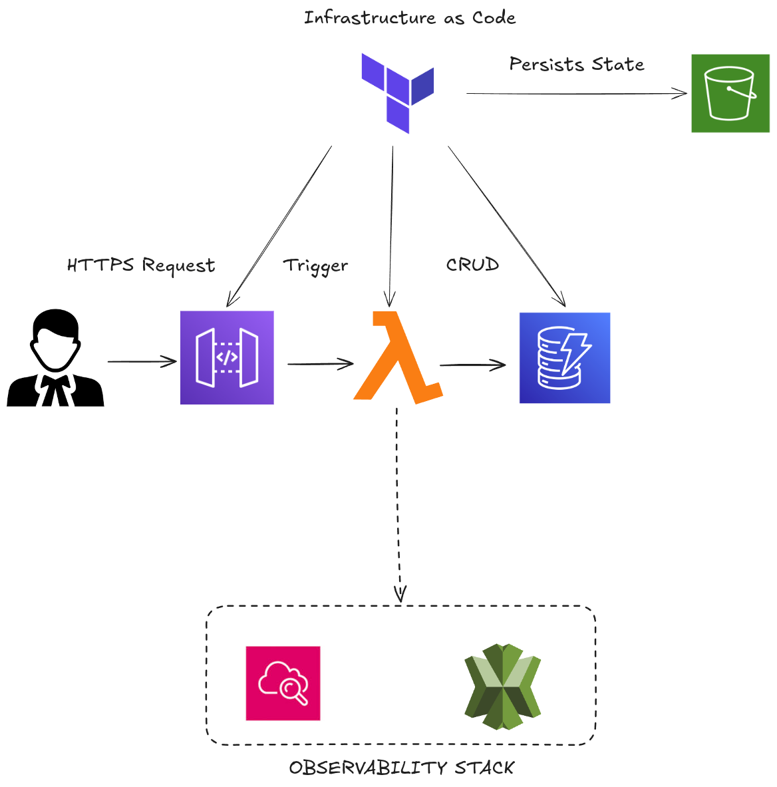

# ⚖️ Lawyer Tasks - Serverless API

Esta é uma solução robusta de Gerenciamento de Tarefas (To-Do) desenvolvida para atender às demandas de rotina de advogados. A aplicação utiliza uma arquitetura Serverless nativa na AWS, garantindo escalabilidade automática, baixo custo operacional e alta disponibilidade.



## 🏗️ Desenho da Solução

A imagem acima detalha o fluxo de dados e a infraestrutura da aplicação:

**Entrada:** O usuário (advogado) realiza requisições HTTPS que são recebidas pelo Amazon API Gateway.

**Trigger & Processamento:** O Gateway dispara uma função AWS Lambda. Esta função utiliza um padrão de "Dispatcher" (no main_handler.py) para rotear a requisição para o handler específico de criação, leitura, atualização ou deleção.

**Persistência (CRUD):** A Lambda interage com o Amazon DynamoDB para armazenar e recuperar os dados das tarefas jurídicas.

**Observabilidade:** Toda a stack é monitorada via AWS X-Ray para rastreamento de requisições e logs estruturados via CloudWatch utilizando a biblioteca AWS Lambda Powertools.

## 🚀 Diferenciais de Engenharia

Esta implementação foi construída focando nos pilares de Engenharia de TI do Itaú:

### 1. Sustentabilidade e Observabilidade

**Tracing Ativo:** Configuração de `tracing_config { mode = "Active" }` no Terraform para o AWS X-Ray, permitindo identificar gargalos de performance em tempo real.

**Logs Estruturados:** Uso do AWS Lambda Powertools para garantir logs padronizados e injetar o contexto da Lambda automaticamente em cada entrada.

### 2. Democratização e Integridade de Dados

**Contratos Rígidos:** Validação de esquemas com Pydantic, garantindo que apenas dados válidos (como os status permitidos: "Pendente", "Em Andamento", "Concluída") sejam processados.

**Filtros de Negócio:** Implementação de busca filtrada por status no endpoint de listagem, permitindo que diferentes áreas consumam os dados de forma segmentada para análise.

### 3. Segurança e Infraestrutura como Código (IaC)

**Least Privilege:** Políticas de IAM customizadas que limitam o acesso da Lambda estritamente às ações de PutItem, GetItem, UpdateItem, DeleteItem e Scan na tabela específica.

**Estado Seguro:** Uso de S3 Remote Backend no Terraform para garantir a integridade e concorrência do estado da infraestrutura em ambientes de equipe.

**CI/CD com Atitude de Dono:** Esteira automática via GitHub Actions que realiza o checkout, setup do Python, empacotamento das dependências e o terraform apply automático no branch main.

## 🛠️ Tecnologias Utilizadas

- **Linguagem:** Python 3.10
- **Infraestrutura:** Terraform
- **Cloud:** AWS (Lambda, API Gateway, DynamoDB, IAM, S3, X-Ray)
- **Qualidade:** Pytest para testes unitários e de integração

## 📑 Endpoints da API

A API segue os padrões REST e está pronta para integração:

| Método | Endpoint | Descrição |
| --- | --- | --- |
| POST | /tasks | Cria uma nova tarefa jurídica |
| GET | /tasks | Lista todas as tarefas. Suporta filtro: /tasks?status=Status |
| GET | /tasks/{id} | Busca os detalhes de uma tarefa específica por ID |
| PUT | /tasks/{id} | Atualiza dados da tarefa, incluindo o registro automático da data de conclusão |
| DELETE | /tasks/{id} | Remove permanentemente uma tarefa do banco de dados |

## ⚙️ Como Executar

### Pré-requisitos

- Python 3.10+
- Terraform instalado
- AWS CLI configurado

### Execução Local (Testes)

A solução prioriza a qualidade com testes automatizados:

```bash
# Instalar dependências
pip install -r requirements.txt

# Executar suíte de testes (Pytest)
python -m pytest tests
```

### Deploy via Terraform

Para realizar o provisionamento automático na AWS:

```bash
cd terraform
terraform init
terraform apply -auto-approve
```

A URL da API será exibida no output `api_url` após o sucesso do comando.
